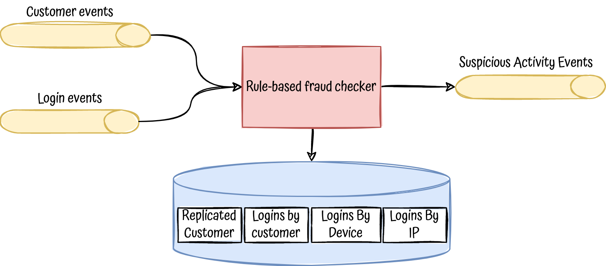

# Simple ruled-based fraud checker

A simple and domain focussed rule-based fraud checker.

## Motivation

Almost all rule-based systems are crazy complex, they are built using rule-engine libraries or DSLs to achieve levels of 
abstraction that usually requires a lot of knowledge to maintain, add new rules or just understand the flows, because most 
of the time, they are just totally over-engineered. 

But, when we start a project, more likely we will have:
- A lot of ambition but a small set of business rules to apply
- An uncertainty about how and when our rules are going to grow

Therefore, do we need to be coupled with a complex code-base? 

No, we want rules that can be easily and quickly adapted to our business necessities, not the business being adapted to our rule-engine.

This project tries to do the opposite of these rule-engines commented above, it tries to build a system without too much abstraction, 
focussed in the problem to solve, built around the domain, a system easy to understand and evolve.

Principles and practices applied:
- YAGNI
- Clean code (easy to understand and change)
- Domain-Driven Design
- Hexagonal Architecture
- Outside-in TDD
- Framework-agnostic: Everything has been done in plain Kotlin

Even though the example is about fraud check, it can easily extrapolated to any other domain with a rule-based problem
to solve.

## Description

Fraud detection systems are usually a mix of rule-based services together with ML services, here we have a really simple
rule-based one:

<p align="center">
  
</p>

This system would consume events from user and logins in an event-driven fashion, store them and trigger a process to
check possible suspicious activity based on the history. If any possible fraud is detected, an event will be raised, 
allowing other system to act consequently.

## What if ...? it grows

If we have the situation that we have to handle to many rules, then, and only then would be time to abstract.

In the current system all the pattern matching for executing the rules is done in [`CheckFraudRule`](/src/main/kotlin/com/fraudchecker/domain/model/service/CheckFraudRule.kt) domain service, and, as you can guess,
it wouldn't scale so well.

Then, what we can do?

Well, there are several ways to approach this:
- Create abstractions such as and iterate through them: 
```kotlin
interface FraudRuleExecutor {
    fun <A> appliesTo(fraudRule: FraudRule<A>): Boolean
    fun <A> execute(fraudRule: FraudRule<A>): List<SuspiciousActivityDetected>
}
```
- You are an engineer right? think about it ;-)

## To consider if used in production

- Add a framework to run it, without it the project is pretty useless :-)
- All the adapters are in memory implementations, just for the sake of the demo, please don't use it in real environments, 
  substitute them by real stream platforms and real data-stores. 
- Consider transactional outbox pattern to deal with dual-writes
- Decouple login storing and use-case triggering (check suspicious login), now it's sync. It can be easily achieved 
  publishing an event to a private stream after storing the login and subscribe to it oin order to trigger the use-case.


